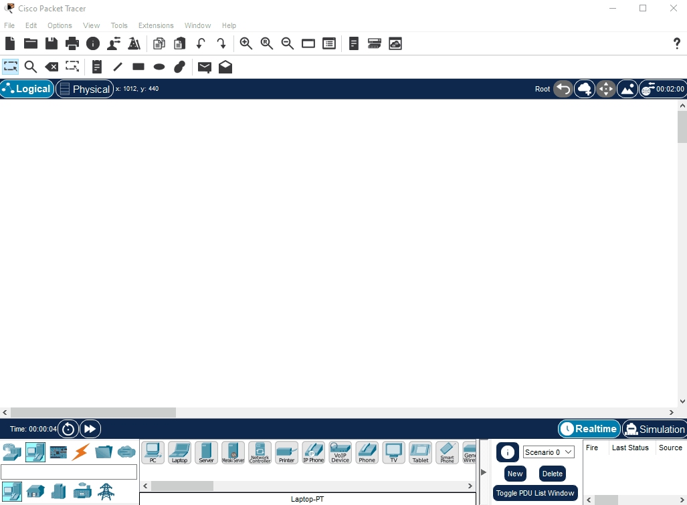

# CISCO Networking Essentials 2.0


Download Cisco Packet Tracer

https://skillsforall.com/resources/lab-downloads

## Cisco Networking Academy

https://skillsforall.com/course/networking-essentials

# Simple Home Network Configuration



# Changing the hostname

```
Switch> enable

Switch# configure terminal

Enter configuration commands, one per line. End with CNTL/Z.

Switch(config)# hostname Praveen

Praveen (config)#
```

# T568A and T568B


